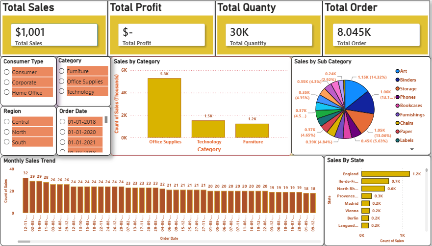

# 📊 Sales Dashboard | Power BI

A professional and interactive **Sales Dashboard** built using **Microsoft Power BI** to analyze sales performance, profit, orders, and customer behavior. This dashboard helps businesses monitor key performance indicators (KPIs) and make data-driven decisions.

---

## 📌 Dashboard Preview

> Add your dashboard screenshot here.



---

## 🚀 Features

- 📈 Total Sales Overview
- 💰 Total Profit Analysis
- 📦 Total Quantity Sold
- 🛒 Total Orders
- 👥 Customer Type Filter
- 🏷️ Category & Sub-Category Analysis
- 🌍 Region-wise Sales
- 📅 Date Slicer
- 📊 Monthly Sales Trend
- 🗺️ State-wise Sales Analysis
- 🎯 Interactive Visualizations with Cross Filtering

---

## 📊 KPIs

| KPI | Description |
|------|-------------|
| Total Sales | Overall revenue generated |
| Total Profit | Total business profit |
| Total Quantity | Total units sold |
| Total Orders | Number of orders placed |

---

## 📈 Dashboard Insights

- Office Supplies generated the highest sales.
- Sales performance can be analyzed by customer type and region.
- Monthly sales trend helps identify seasonal patterns.
- State-wise analysis highlights top-performing locations.
- Sub-category analysis provides detailed product performance.

---

## 🛠️ Tools & Technologies

- Microsoft Power BI
- Power Query
- DAX (Data Analysis Expressions)
- Data Modeling
- Excel / CSV Dataset

---

## 📂 Project Structure

```
Sales-Dashboard/
│
├── Sales Dashboard.pbix
├── Dataset.xlsx
├── dashboard.png
└── README.md
```

---

## 📸 Dashboard Components

- KPI Cards
- Bar Chart
- Pie Chart
- Monthly Trend Analysis
- State-wise Sales
- Interactive Slicers

---

## 🎯 Business Use Cases

- Sales Performance Monitoring
- Regional Sales Analysis
- Customer Segmentation
- Product Category Analysis
- Executive Reporting
- Business Decision Support

---

## 📥 How to Use

1. Clone this repository.
2. Open the `.pbix` file using Microsoft Power BI Desktop.
3. Refresh the dataset if required.
4. Explore the interactive dashboard.

---

## 📷 Screenshot

> Replace this image with your dashboard screenshot.


---

## 👨‍💻 Author


- GitHub: https://github.com/babluyadav25
- LinkedIn: https://linkedin.com/in/BabluYadav

---

## ⭐ Support

If you found this project useful, please consider giving it a ⭐ on GitHub.

---

## 📜 License

This project is licensed under the MIT License.
